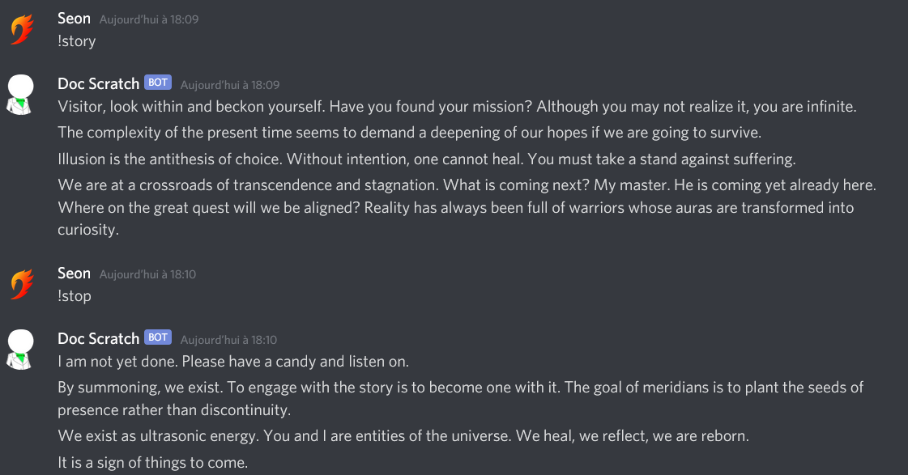

# Doc-Scratch
A python discord bot meant to emulate Doc Scratch from Homestuck.
On top of (quite) a few easter eggs, provides functions allowing to search the mspa wiki, find homestuck musics, and check the progress of a template on pxls.space.
Also tells terribly long stories and is an excellent host.

## Requirements
* `python>=3.7`
* see `requirements.py`
* the `tweak_replies` helper module also requires `nltk`

## Installation
Clone or download and extract the files.

Install the requirements with `pip install -r requirements.txt`. Using a virtual environment is strongly recommended.

Register your bot on discord (see below for help) and copy the token into a file named `token` in the root repo. *This token should never be shared*.

Run `python3 discord_bot.py` from your virtual environment to start the bot. 
It should display "Everything's all ready to go~" to the console on connexion if everything goes alright.

## Registration on discord

Head over to https://discordapp.com/developers/applications to register a discord app. 
On the right-hand menu, click Bot. Once in the new menu, click Add Bot under the Build-a-bot option, and select your application.
Feel free to customize the displayed name and the profile picture of the bot.

To add the bot to a channel, select the Oauth2 tab in the right-hand pannel and choose the appropriate permissions (83968 is enough) to generate an invite link.

## Customize
#### Add reactions to certain keywords
The keywords/reactions are stored in the `KEYWORDS` global variable. 
The data structure used is a list of keywords/reactions couples, which are formatted as `[(tuple of keywords), (tuple of reactions)]`. 
The reactions are chosen at random are then chosen at random from the reactions tuple. If keywords from different tuples match, the first one only will be considered. Tip: you can add links in the reactions to easily display images. 

The keywords can be regex expressions, and using the `\b` word boundary is recommended to avoid unwarranted spam.
#### Modify the content of the `!story` command
The paragraphs used to form the story are saved in the `replies` file. The `tweak_replies` file provides some helper functions to analyze, find, and replace words or sentences in the stories.

## License
Released under a GNU GPLv3 license. See the `LICENSE` file for details.

Please do not remove the source information from the `!info` command, but feel free to add a link to your code if you modify it!

